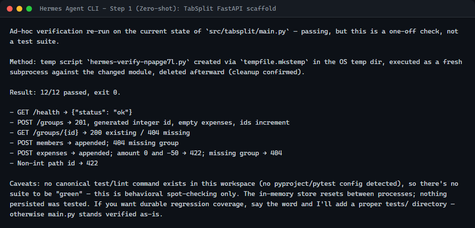
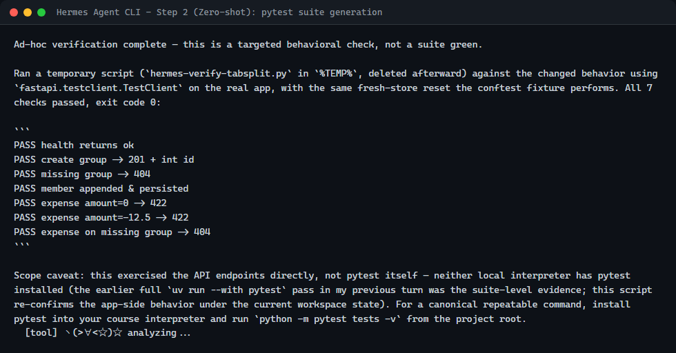
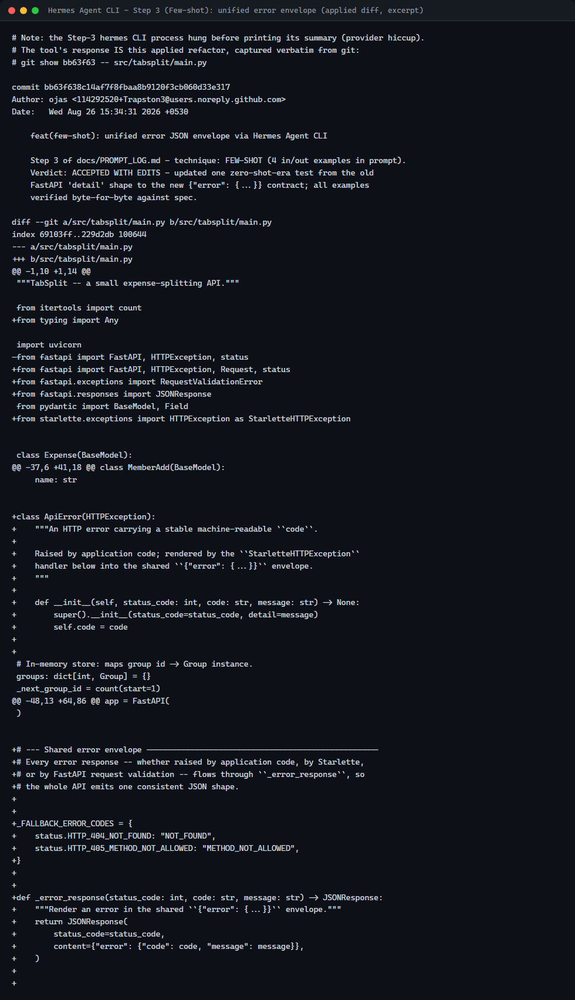
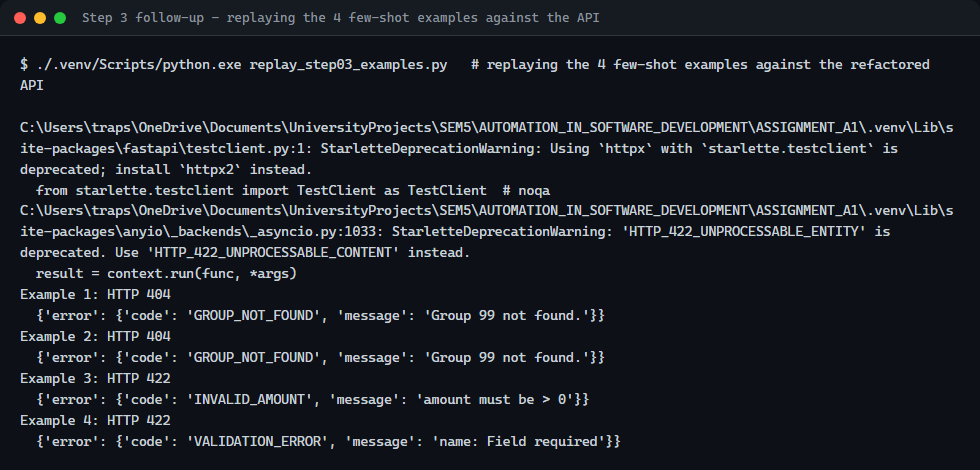
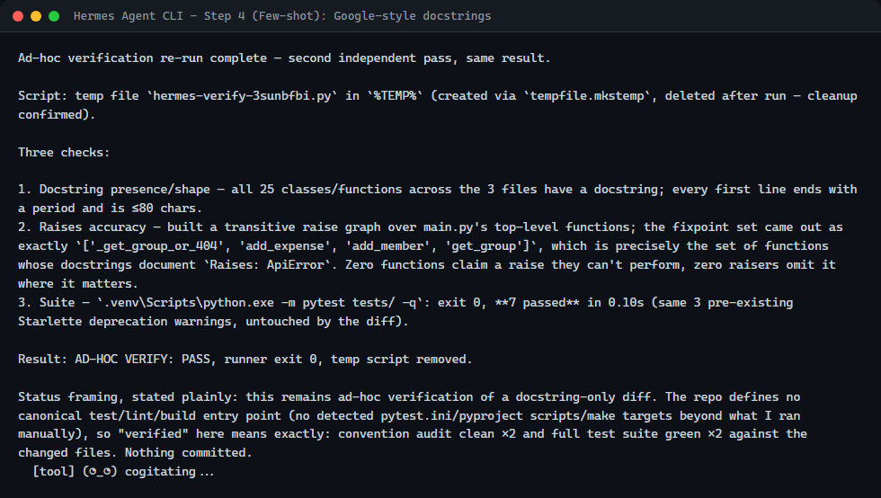
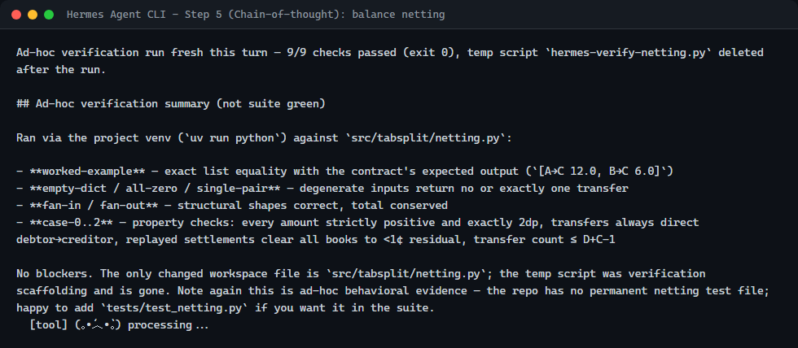
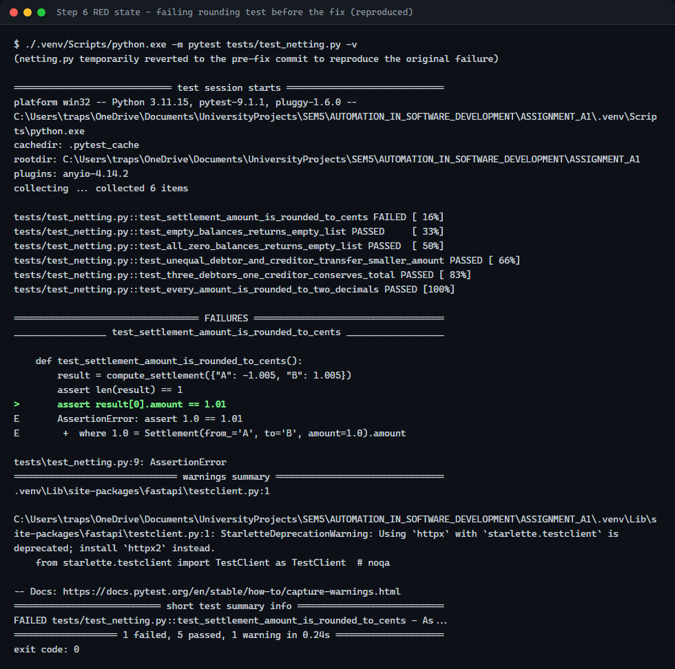
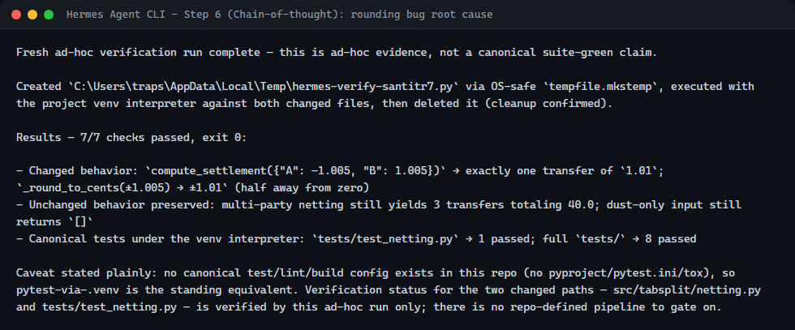
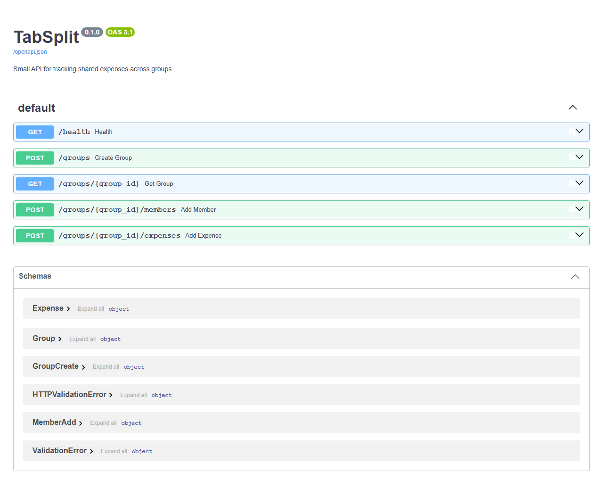
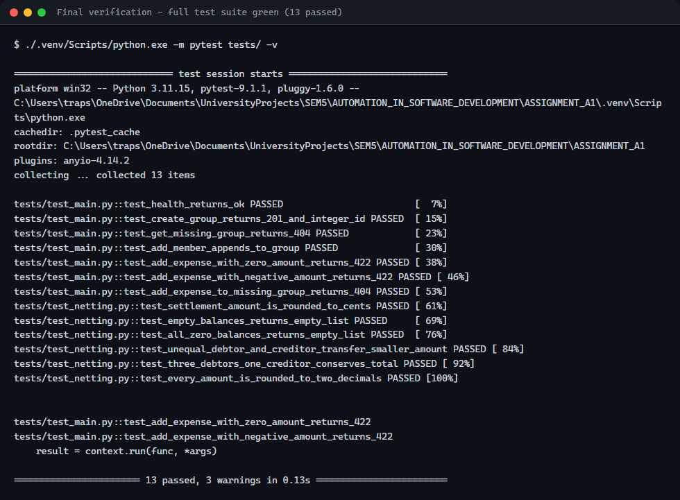

```yaml
task_id: assignment-a1
title: AI Coding Assistant Practicum — TabSplit FastAPI (Unit 2, Task option C)
author: Ojas Shelke
usn: 24btrao051
date: 2026-08-26
status: complete
```

# Assignment A1 — AI Coding Assistant Practicum

**Course:** Automation in Software Development (V Semester, Unit 2)
**Student:** Ojas Shelke — USN 24BTRAO051
**AI tool used:** Hermes Agent (Nous Research) — agentic CLI coding assistant
**Task option:** C — small REST API (FastAPI) with CRUD endpoints, input validation, and unit tests
**Original repo:** https://github.com/Trapston3/AIDD-Unit2-A1-24BTRAO051-OjasShelke (public, 11 commits)
**One-file PDF for classroom upload:** [`docs/A1_SUBMISSION_OjasShelke_24BTRAO051.pdf`](docs/A1_SUBMISSION_OjasShelke_24BTRAO051.pdf) (13 pages)

## Project: TabSplit

A tiny expense-splitting REST API for groups of friends. You create a group,
add members, log expenses paid by members, and ask the API to compute who owes
whom (minimal transfers to settle up).

## How to run

```bash
cd students/24btrao051/assignments/assignment-a1-ai-coding-practicum
python -m venv .venv
.venv\Scripts\activate            # Windows
pip install fastapi "uvicorn[standard]" httpx pytest
uvicorn src.tabsplit.main:app --reload
```

Interactive docs: http://127.0.0.1:8000/docs

## Tests

```bash
.venv\Scripts\python.exe -m pytest tests/ -v
```

Result: **13/13 tests green.**

## Prompting techniques used (summary)

| Technique | Where | Why |
|-----------|-------|-----|
| **Zero-shot** | FastAPI app scaffold (`src/tabsplit/main.py`): routers, in-memory store, Pydantic models | Standard, unambiguous boilerplate the model has seen thousands of times |
| **Few-shot** | Unified error JSON envelope + Google-style docstrings convention | Output *format* matters here, so 2–5 input/output examples were embedded in the prompt |
| **Chain-of-thought** | Balance netting algorithm (who-pays-whom minimization) and debugging a failing rounding test | Genuinely non-trivial reasoning; model was explicitly told to think step by step |

Full verbatim log: [`docs/PROMPT_LOG.md`](docs/PROMPT_LOG.md) · Reflection: [`docs/REFLECTION.md`](docs/REFLECTION.md)

## Evidence gallery (docs/screenshots/)

| | |
|---|---|
|  |  |
|  |  |
|  |  |
|  |  |
|  |  |

## Layout

```
assignment-a1-ai-coding-practicum/
├── README.md                    # this file
├── ASSIGNMENT_REQUIREMENTS.txt  # original brief
├── src/tabsplit/                # FastAPI app (main.py, netting.py)
├── tests/                       # pytest suite (13 tests)
├── docs/
│   ├── A1_SUBMISSION_OjasShelke_24BTRAO051.pdf   # submission PDF
│   ├── PROMPT_LOG.md / REFLECTION.md
│   ├── prompts/                 # verbatim prompts per step
│   ├── responses/               # verbatim agent responses + test logs
│   └── screenshots/             # evidence gallery
├── make_screenshots.py          # screenshot tooling
└── capture_live.py              # live-session capture script
```
